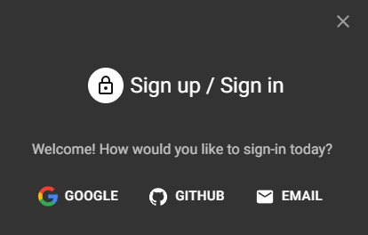
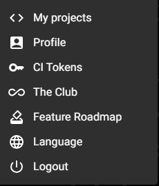

# RPP

Mikrokrmilniki predstavljajo ključni gradnik sodobnih elektronskih sistemov, ki omogočajo avtomatizacijo in nadzor nad številnimi napravami v vsakdanjem življenju. V tem učbeniku boste spoznali temeljne koncepte programiranja mikrokrmilnikov, kar vam bo omogočilo razvoj učinkovitih in prilagodljivih rešitev za najrazličnejše tehnične izzive.

Razumevanje delovanja mikrokrmilnikov odpira vrata v svet integriranih sistemov, kjer se teorija prepleta s prakso, inovacije pa s tehničnim znanjem. Na poti boste osvojili znanja, potrebna za načrtovanje, programiranje in optimizacijo aplikacij, ki se uporabljajo v industriji, medicini, avtomatizaciji in drugih področjih, kjer je natančnost in zanesljivost ključnega pomena.

Ta učbenik je zasnovan kot temeljni vodnik za dijake, ki želijo razumeti in obvladati področje programabilnih sistemov. Uspešno obvladanje te snovi vam bo omogočilo boljše razumevanje kompleksnih elektronskih sistemov in vas pripravilo na nadaljnje raziskovanje naprednejših tehnologij.

## Predmet

### Kontakti

**Andrej Arh**

Teams/mail: andrej.arh@sckr.si

**Aleš Kozjek**

Teams/mail: ales.kozjek@sckr.si

**Lovro Mohorič**

Teams/mail: lovro.mohoric@sckr.si

**Matic Ržek**

Teams/mail: matic.rzek@sckr.si

# Navodila za uporabo Wokwi

Wokwi je spletno orodje za simulacijo in razvoj projektov z mikrokontrolerji, kot so Arduino, ESP32 in drugi. S temi navodili se boste naučili, kako se registrirati, navigirati po menijih in odpreti projekt.

## 1. Registracija

1. Obiščite spletno stran [Wokwi](https://wokwi.com/).
2. Kliknite na gumb **"Sign In"** v zgornjem desnem kotu. 

3. Izberite način prijave, ki vam ustreza:

    - Prijava s **GitHub** računom.  
    - Prijava z **Google** računom.  
    - Prijava z **Email** naslovom.
    

4. Sledite navodilom na izbranem načinu prijave in potrdite svojo identiteto.Po uspešni registraciji boste preusmerjeni na začetno stran Wokwi.

## 2. Premikanje po menijih

    1. Na **desnem meniju** lahko najdete naslednje kategorije:

    - **My projects**: Dostop do vaših projektov in ustvarjanje novih.
    - **Profile**: Pregled in urejanje vaših profilnih podatkov.
    - **CI Tokens**: Upravljanje in ustvarjanje CI žetonov (Continuous Integration Tokens).
    - **The Club**: Dostop do skupnosti in ekskluzivnih funkcij.
    - **Feature Roadmap**: Pregled načrtovanih funkcij in sprememb na platformi.
    - **Language**: Spreminjanje jezika uporabniškega vmesnika.
    - **Logout**: Odjava iz računa.

2. Na **zgornjem meniju** lahko dostopate do:

    - **Dashboard**: Vaša nadzorna plošča z vsemi informacijami o projektih.
    - **Create New**: Ustvarjanje novega projekta.

## 3. Odprtje projekta

1. Na začetni strani ali v meniju **Projects** poiščite projekt, ki ga želite odpreti.
2. Kliknite na ime projekta, da se odpre v simulatorju.
3. Po odprtju projekta boste videli:
    - Delovno površino, kjer je mogoče postaviti komponente.
    - Okno za kodo, kjer lahko urejate programsko kodo za mikrokontroler.
    - Konzolo, kjer se prikažejo napake in rezultati simulacije